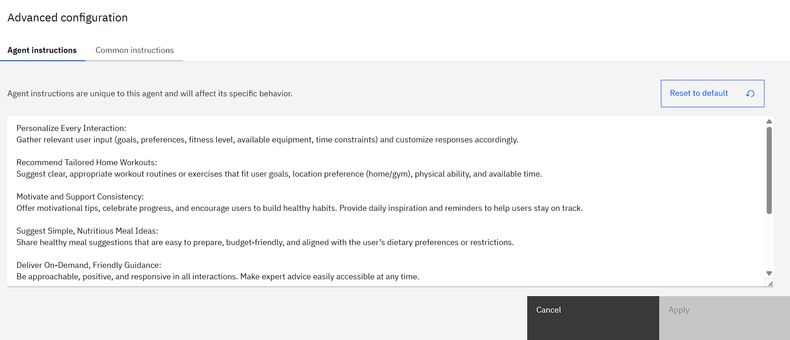
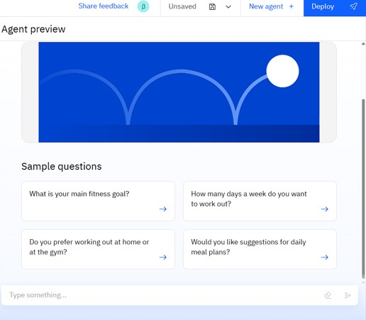
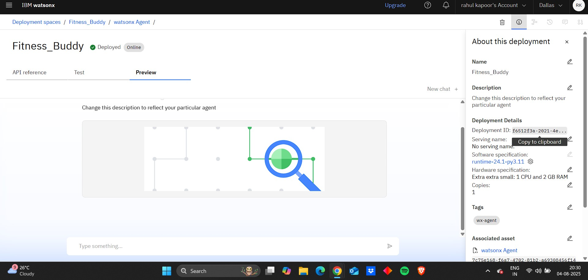
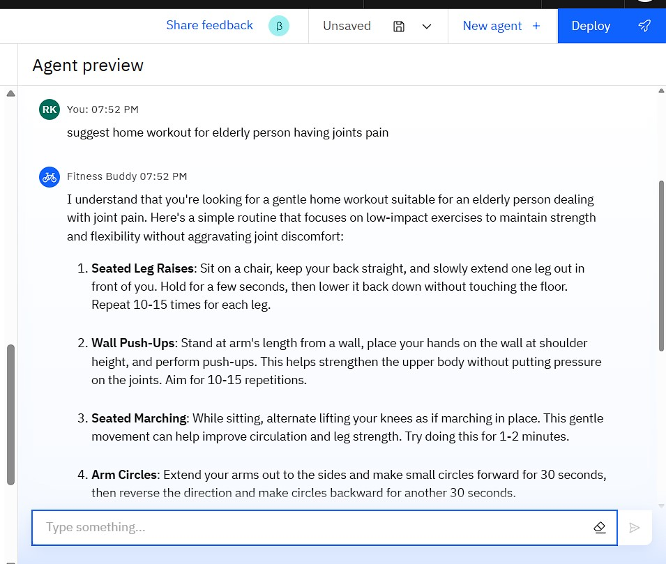

# Fitness_Buddy
Fitness Buddy is an intelligent AI agent designed to help users achieve their health and fitness goals with ease. Whether you're a beginner or a seasoned athlete, this virtual companion provides personalized workout plans, tracks progress, offers nutritional advice, and keeps you motivated on your fitness journey.

## 🧩 Problem Statement

Many people struggle to maintain a consistent fitness routine due to lack of personalized guidance, motivation, or understanding of effective workouts and nutrition. Generic fitness plans often lead to frustration, injuries, or abandonment of goals—especially among beginners.

## 💡 Proposed Solution

Fitness Buddy is an AI-powered virtual fitness coach designed to offer personalized workout plans, dietary suggestions, and motivation tips based on user goals and preferences. It engages users through natural conversations, helps track progress, and makes fitness guidance accessible to all.

## 🧠 Technologies Used

* IBM cloud lite services
* Natural Language Processing (NLP)
* Retrieval Augmented Generation (RAG)
* IBM Granite model
*IBM Cloud Object Storage

## ☁️ IBM Cloud Services Used

* Watsonx.ai Studio
* IBM Granite Model
* IBM Cloud Lite Account
* IBM Cloud IAM
* IBM Cloud Object Storage

## 👥 End Users

* Fitness enthusiasts and beginners
* People seeking home-based workout guidance
* Students and working professionals
* People recovering from injuries or requiring low-impact workouts
* Gyms and personal trainers for client support
* NGOs promoting community health

## 🌟 WOW Factors

* Personalized fitness plans based on goals (weight loss, muscle gain, stamina, etc.)
* Nutrition and hydration tips tailored to workout intensity
* Document-based knowledge retrieval (e.g., certified fitness guides or studies)
* Motivational chat and habit-building support
* Multilingual fitness assistance (optional)
* Handles non-fitness queries politely
* Easy integration with wearable data (future scope)

## 🧪 Key Features

* AI-based chat for fitness Q&A
* Custom workout generator based on user input
* Dietary and hydration guidance
* Natural language responses using LLM
* RAG support for document-backed answers (optional)
* Progress tracking module (optional)

## 🚀 How It Works

* User inputs a query (e.g., “Give me a 30-minute beginner home workout”)
* IBM Granite LLM processes the language
* The AI responds with a tailored, easy-to-follow answer or plan

## 🖼️ Screenshots
### 🔹 Setting up..

### 🔹 Agent Instructions...

### 🔹 Quick Start Questions...

### 🔹 Tools used & Testing...

### 🔹 Deployment & Preview...

### 🔹 Result...

### 🔹 Resources List...

## 📌 How to Run or Deploy

1. Log in to IBM Cloud Lite: https://cloud.ibm.com
2. Launch Watsonx.ai Studio
3. Create a new AI Agent
4. Upload financial PDFs to a Vector Index
5. Choose Tools for web search (Google,Wikipedia,DuckDuckGo etc..)
6. Configure agent instructions and topics (restricting AI from answering off-topic questions politely)
7. Test in the preview panel
8. Deploy via web snippet, Streamlit, or custom web UI

---

## 🛣️ Future Scope

- WhatsApp or mobile app integration  
- Speech-to-text input for voice-driven queries  
- Automatic monthly report generation

## 🔗 Useful Links

- [IBM Cloud Lite](https://cloud.ibm.com/registration)
- [IBM Watsonx.ai](https://www.ibm.com/products/watsonx-ai)
- [IBM SkillsBuild](https://skillsbuild.org)

  > Created during the IBM SkillsBuild for Academia Internship 2025 by **Rahul Kapoor**

